# Auto-atendimento de uma mercearia chamada JuMarket

# O que é esse projeto?
Esse projeto é um desafio proposto pela TQI da qual eu devo criar um sistema de 
auto-atendimento para uma merceária fictícia chamada JuMarket. Além de eu ter criado 
o sistema de acordo com os requisitos propostos pela TQI, eu incrementei o projeto com 
várias regras de negócios adicionais, 1 tabela adicional, 2 opções para criar um 
container e todas as camadas com testes unitários feitos (68 testes no total).


# Tecnologias usadas
- [X] Spring Boot
- [X] Kotlin
- [X] Spring Web MVC
- [X] Spring Data JPA com Hibernate
- [X] Gradle
- [X] Flyway Migration
- [X] JUnit
- [X] MockK
- [X] MySQL (produção)
- [X] H2 Database (testes)
- [X] Swagger (documentação)
- [X] Docker

# Como executar o projeto?

Tenha obrigatoriamente o **JDK 17** e opcionalmente o Gradle no seu sistema.

### Via repositório
Faça um ```git clone``` ou download do meu repositório e coloque na pasta de sua escolha.
Entre no ```src/main/resources/application.properties``` e altere esses parâmetros abaixo para o seu próprio banco de dados MySQL.
```properties
spring.datasource.url=jdbc:mysql://seubancoaqui
spring.datasource.username=seu usuário aqui
spring.datasource.password=sua senha aqui
spring.datasource.driver-class-name=com.mysql.cj.jdbc.Driver
```
Se não houver o Gradle no seu sistema operacional, abra o terminal dentro da pasta raiz do projeto e execute o seguinte comando para baixar a versão correta do Gradle para o projeto:
```bash
./gradlew
```
Escolha a IDE da sua escolha e seu banco de dados MySQL e inicie o projeto.

### Via container (somente o banco de dados)
Tenha certeza de que suas portas 8080 e 3306 estejam abertas na sua rede e que você já tenha o Docker e Docker Compose, depois siga os passos abaixo, um de cada vez:

Faça um clone do repositório ou download e entre na pasta.
```bash
git clone https://github.com/Matysys/tqi_Kotlin_backend_developer_2023.git
cd tqi_Kotlin_backend_developer_2023
```
Abra a IDE da sua escolha e coloque o comando abaixo no terminal:
```bash
docker-compose -f onlydb.yml up -d
```
Assim um container com o banco de dados será criado e você poderá iniciar a aplicação. 
Não confunda os arquivos, o **onlydb.yml** só deve ser usado para o banco de dados 
sozinho.

Se quiser parar o container rapidamente, use:

```bash
docker-compose down
```

### Via container (aplicação e banco de dados)


Faça um clone do repositório ou download e entre na pasta.
```bash
git clone https://github.com/Matysys/tqi_Kotlin_backend_developer_2023.git
cd tqi_Kotlin_backend_developer_2023
```
Se não tiver **Gradle** no seu sistema, utilize o comando abaixo no seu terminal se 
ainda não utilizou para baixar a versão local do Gradle que há no projeto:

```bash
./gradlew
```
Agora compile a aplicação com o comando abaixo:
```bash
./gradlew bootJar
```
Em seguida crie os dois containers usando o comando abaixo:
```bash
docker-compose up -d
```
Assim 2 containers serão criados para a sua aplicação, um com a aplicação compilada
(.jar) e outra com o banco de dados MySQL, e você poderá testar.

Se quiser parar o container rapidamente, também pode utilizar o mesmo exemplo do 
método anterior:

```bash
docker-compose down
```
Imagem de exemplo utilizando o WSL (Subsistema do Windows para Linux)
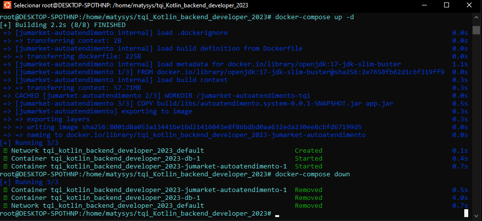

## Testes unitários
Todos as camadas foram testadas com 100% de coverage. Execute os testes com:
```bash
./gradlew test
```
O banco de dados H2 Database foi o escolhido para os testes por rodar em memória.

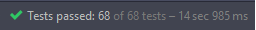

## Diagrama de classes (UML)

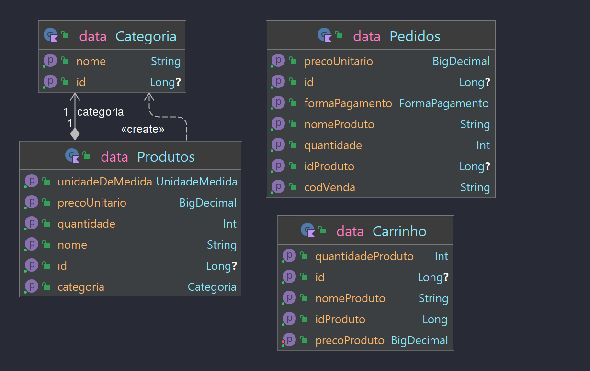

## Modelagem do banco de dados

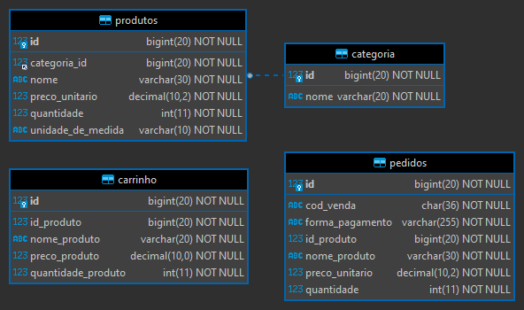

## Diagrama de casos de uso

Criei um diagrama de casos de uso com auxílio do **VisualParadigm.**

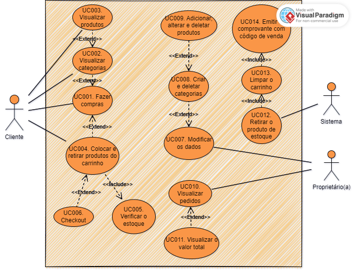

### Requisitos funcionais

- Cadastro de Produtos
- Listagem de Produtos por id, nome, categoria ou sem condições
- Alterar os Produtos
- Exclusão dos Produtos
- Controle de estoque automático
- Cadastro de Categorias
- Listagem de Categorias
- Listagem de Categorias por id ou sem condições
- Exclusão das Categorias
- Colocar um produto no carrinho
- Alterar um produto do carrinho
- Exclusão do carrinho ou produto pelo id
- Listagem do carrinho
- Finalizar uma Venda e ter o valor total e código de venda retornados
- Listagem de pedidos concluídos por código de venda, valor total pago ou sem condições

### Requisitos Não Funcionais

- Deve ser feito usando a linguagem de programação Kotlin
- Deve usar um framework
- Deve utilizar MySQL como banco de dados de produção
- Deve incluir testes unitários

# Endpoints

No caso do projeto ser executado localmente, vou assumir que o endpoint inicial é:
```
http://localhost:8080/api/
```

Você pode usar o próprio **Swagger** que disponibilizei para testar a API:

```
http://localhost:8080/swagger-ui.html
```

Ou você pode utilizar o **Postman**, **Insomnia** e o **cURL**. Eu utilizei o
Insomnia para os meus testes manuais.

## Categorias

### Adicionar uma categoria

Endpoint:
```
http://localhost:8080/api/categoria
```

Método de requisição: *POST*

HTTP Status se for realizado com sucesso: 200

Retorno: "A categoria {categoria} foi adicionada com sucesso!"

Vamos criar 3 categorias diferentes chamadas "Bebidas", "Japone" e "Lanches" 
 em formato JSON e enviar a requisição no formato abaixo, um de cada vez.

```json
{
    "nome": "Bebidas"
}
```
```json
{
    "nome": "Japone"
}
```
```json
{
    "nome": "Lanches"
}
```

Veja que a segunda categoria tem um erro proposital na escrita que logo será explicado, 
então vamos para o próximo endpoint.

### Visualizar todas as categorias

Endpoint:
```
http://localhost:8080/api/categoria
```

Método de requisição: *GET*

HTTP Status se for realizado com sucesso: 200

Retorno: Lista de Categorias

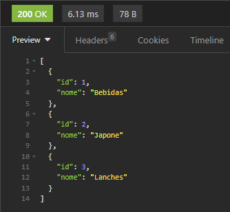

### Visualizar uma categoria pelo ID

Endpoint:
```
http://localhost:8080/api/categoria/id
```
Substitua o *id* pelo número do ID da categoria

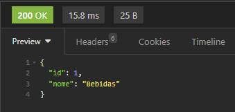

### Apagar uma categoria pelo ID

Endpoint:
```
http://localhost:8080/api/categoria/id
```

Método de requisição: *DELETE*

HTTP Status se for realizado com sucesso: 200

Retorno: "Categoria de número {id} deletada com sucesso"

Substitua o *id* pelo número 2, vamos deletar a categoria com escrita errada, a 
categoria "Japone".

Categoria deletada:

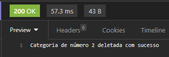

Nova visualização:

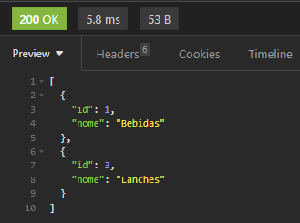

### Apagar todas as categorias

Endpoint:
```
http://localhost:8080/api/categoria
```

Método de requisição: *DELETE*

HTTP Status se for realizado com sucesso: 200

Retorno: "Todas as categorias foram deletadas com sucesso."

## Produtos

### Adicionar um produto

Endpoint:
```
http://localhost:8080/api/produtos
```

Método de requisição: *POST*

HTTP Status se for realizado com sucesso: 200

Retorno: "O {produto} foi adicionado com sucesso!"

Vamos adicionar 3 produtos diferentes, 2 produtos vão estar na mesma categoria, 
enquanto o outro vai estar na categoria restante

```json
{
 "nome": "X-burguer",
 "unidadeDeMedida": "UNIDADE",
 "categoriaId": 3, 
 "precoUnitario": 7.50,
 "quantidade": 30
}
```
```json
{
 "nome": "X-salada",
 "unidadeDeMedida": "UNIDADE",
 "categoriaId": 3, 
 "precoUnitario": 9.50,
 "quantidade": 25
}
```
```json
{
 "nome": "Coca-cola",
 "unidadeDeMedida": "LITRO",
 "categoriaId": 1, 
 "precoUnitario": 7.50,
 "quantidade": 11
}
```
Um de cada vez, a categoriaId 1 é das Bebidas, e o 3 dos Lanches. Se uma categoria 
for inválida, você receberá o retorno abaixo:

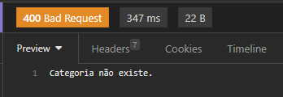

Também não tente deletar uma categoria da qual já tem produtos registrados, pois 
você receberá esse retorno:

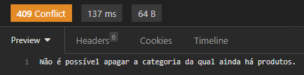

A *unidadeDeMedida* só pode ser *QUILOGRAMA*, *UNIDADE* ou *LITRO*. 
A quantidade mínima do produto deve ser 1. O preço pode ser 0, pois pode ser usado 
em ocasiões bem específicas.

### Listar todos os produtos

Endpoint:
```
http://localhost:8080/api/produtos
```

Método de requisição: *GET*

HTTP Status se for realizado com sucesso: 200

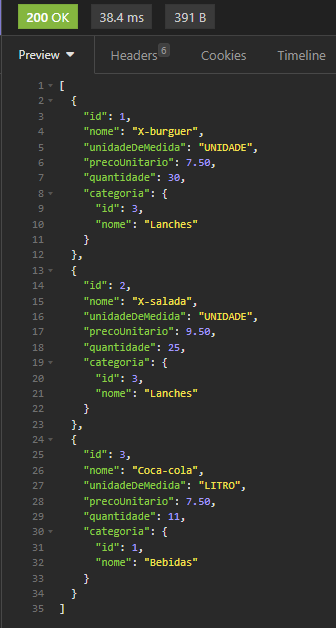

Endpoint via ID:
```
http://localhost:8080/api/produtos/s?id=
```

Coloque o número 2 após o sinal de igual:

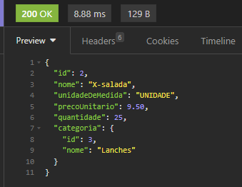

Endpoint por nome:
```
localhost:8080/api/produtos?nome=
```

Esse endpoint usa a busca por **%LIKE%** no banco de dados, isso é, busca pelos 
caracteres existentes.

Digite "X-" após o sinal de igual:

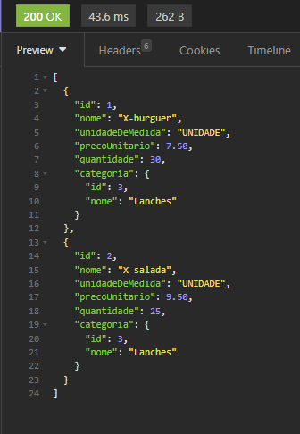

Endpoint por categoria:
```
localhost:8080/api/produtos?categoriaId=
```

Coloque o ID da categoria após o sinal de igual, use o número 1 agora:

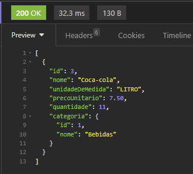

Você também pode mescar assim:
```
localhost:8080/api/produtos?nome=NOME&categoriaId=ID
```

### Deletar um produto

Endpoint:
```
http://localhost:8080/api/produtos/id
```

Método de requisição: *DELETE*

HTTP Status se for realizado com sucesso: 200

Retorno: "Produto de ID:{id} excluído com sucesso!"

Vamos deletar o X-salada, seu ID é 2, após isso visualizar todos os produtos novamente:

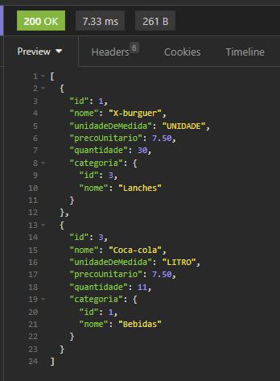

### Alterar um produto

Endpoint:
```
http://localhost:8080/api/produtos/alterar
```

Método de requisição: *PUT*

HTTP Status se for realizado com sucesso: 200

Retorno: "O produto de ID: {id} foi alterado com sucesso!"

Altere o produto "X-burguer" que tem ID 1, enviae os dados em *JSON* dessa forma:

```json
{
 "id": 1,
 "nome": "X-tudo",
 "unidadeDeMedida": "UNIDADE",
 "precoUnitario": 11.50,
 "categoriaId": 3,
 "quantidade": 22
}
```

A diferença em relação a adicionar um produto, aqui você deve incluir o ID do pro
duto que deseja ser alterado. Agora o antigo "X-burguer" tem esses novos dados.

Nova visualização pelo GET:

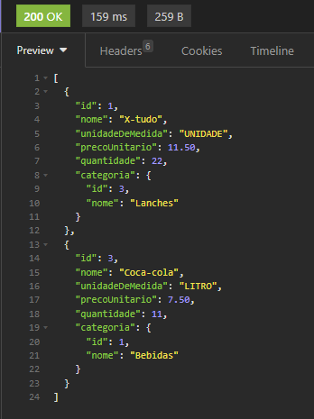

## Carrinho

### Adicionar um produto no carrinho

Endpoint:
```
http://localhost:8080/api/carrinho
```

**OBSERVAÇÃO:** Essa tabela sempre será deletada e sofrerá um **TRUNCATE** toda vez 
que um pedido for concluído.

Método de requisição: *POST*

HTTP Status se for realizado com sucesso: 200

Retorno: "O carrinho foi atualizado com sucesso"

Vamos adicionar os 2 produtos no carrinho em formato *JSON* dessa forma, um de cada vez:

```json
{
 "idProduto": 1,
 "nomeProduto": "X-tudo",
 "quantidadeProduto": 6
}
```
```json
{
 "idProduto": 3,
 "nomeProduto": "Coca-cola",
 "quantidadeProduto": 4
}
```

Coloque o ID do produto a ser adicionado e o nome como dupla confirmação, depois 
coloque a quantidade desejada do produto.

Não coloque uma quantidade acima do que existe na tabela dos produtos, ou você terá 
esse retorno:

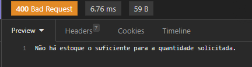

Também não repita o mesmo produto no carrinho, ou terá o retorno abaixo:

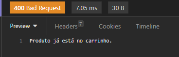

### Listar produtos do carrinho

Endpoint:
```
http://localhost:8080/api/carrinho
```

Método de requisição: *GET*

HTTP Status se for realizado com sucesso: 200

Veja o resultado abaixo que interessante, ele já calcula o preço total de cada 
produto com base na quantidade:

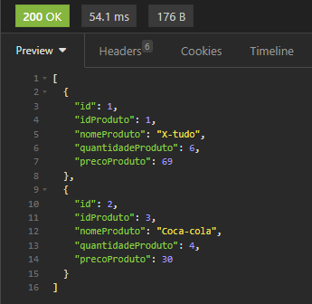

6 x 11,50 do "X-tudo" = 69 reais

4 x 7,50 = 30 reais

Pode ser que alguns valores não estejam tão precisos. O valor só será formatado na 
venda final.

### Alterar produtos do carrinho

Endpoint:
```
http://localhost:8080/api/carrinho/update
```

Método de requisição: *PATCH*

HTTP Status se for realizado com sucesso: 200

Vamos alterar a quantidade da Coca-Cola de 4 para 6 via *JSON* da mesma forma que 
você inseriu um produto no carrinho:

```json
{
 "idProduto": 3,
 "nomeProduto": "Coca-cola",
 "quantidadeProduto": 6
}
```

Nova visualização com o preço calculado novamente:


7,50 x 6 = 45 reais

6 x 11,50 do "X-tudo" = 69 reais

4 x 7,50 = 30 reais

Pode ser que alguns valores não estejam tão precisos. O valor só será formatado na
venda final.


### Deletar um produto do carrinho ou deletar todo o carrinho

Endpoint por ID:
```
http://localhost:8080/api/carrinho/id
```

Endpoint para deletar totalmente:
```
http://localhost:8080/api/carrinho
```

Método de requisição: *DELETE*

HTTP Status se for realizado com sucesso: 200

Não há retorno algum, só apaga tudo. O ID que você deve colocar não é o do produto, 
mas é o ID temporário do carrinho que você viu na visualização. Esse ID seria invi
sível em algum Frontend.

**NÃO FAÇA ISSO POR ENQUANTO, POIS VAMOS USAR ESSE CARRINHO PARA CONCLUIR O PEDIDO!**

## Pedidos

### Adicionar um produto no carrinho

Endpoint:
```
http://localhost:8080/api/pedidos
```

Método de requisição: *POST*

HTTP Status se for realizado com sucesso: 200

Aqui só devemos informar o método de pagamento via *JSON* dessa forma:

```json
{
 "formaPagamento": "CARTAO_CREDITO"
}
```
As opções disponíveis são:
- CARTAO_CREDITO
- CARTAO_DEBITO
- PIX
- DINHEIRO

Qualquer outra coisa diferente das citadas vai dar um retorno inválido.

Agora veja como o retorno é interessante:

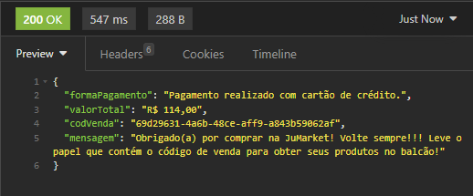

Vamos analisar! Ele retorna a mensagem indicando o pagamento escolhido, o código 
de venda único para o(a) proprietário(a) saber seus pedidos, a mensagem de procedimento para pegar os pedidos e o valor total da venda.

O valor total deu R$ 114,00
R$ 45,00 + R$ 69,00 = R$ 114,00
O valor veio formatado!

Esse retorno seria impresso em um papel da máquina de auto-atendimento, assim seria possível levar para o balcão.

Aqui o pagamento já é dado como concluído, mas eu creio que uma API de pagamento 
seria um intermediária para pagar essa compra, assim dando o valor para o(a) pro
prietário(a).

Agora outra coisa interessante aconteceu, liste os produtos novamente e olhe as quantidades atuais.

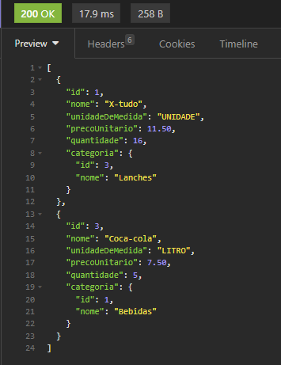

O estoque é removido sempre que um pedido é concluído!
Antes o produto "Coca-cola" tinha 11 exemplos, e o "X-tudo' tinha 22 exemplos.
11 - 6 = 5
22 - 6 = 16

O estoque é sempre atualizado automaticamente.

### Visualizar pedidos pelo código de venda

Endpoint:
```
http://localhost:8080/api/pedidos?cod=
```
Coloque o código de venda após o sinal de igual

Método de requisição: *GET*

HTTP Status se for realizado com sucesso: 200

Visualização:

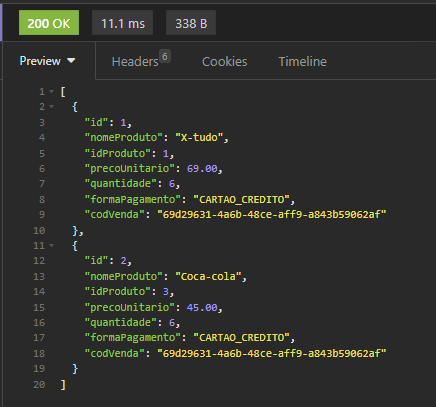

Agora para ver o valor total, use esse endpoint:
```
http://localhost:8080/api/pedidos?cod=cod&total=true
```
Substituindo o valor do *cod* após o sinal de igual, e deixe o valor de *total* como **true**.

Visualização:

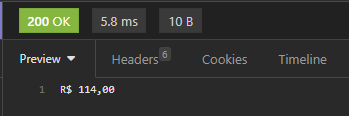

O endpoint abaixo retorna todos os pedidos com todos os códigos de venda:
```
http://localhost:8080/api/pedidos?cod={cod}&total=true
```

O(a) proprietário(a) verá os produtos pelo seu código de venda.

# ---> CONCLUSÃO <---

Projeto interessante, mesmo que embora simples, eu tentei aperfeiçoar da minha própria maneira. Eu aprendo errando, ou seja, corrigindo vários bugs e aprendendo com 
isso.

Eu criei uma tabela adicional chamada *Pedidos* somente para ficar algo mais próximo da realidade, pois o(a) proprietário(a) deve conseguir visualizar quem 
fez alguma compra no seu estabelecimento. Também não há a existência de um usuário, 
pois isso seria mais burocrático numa máquina de auto-atendimento de uma merceária 
pequena. Portanto, o foco é na agilidade! O cliente escolhe a categoria, escolhe os 
produtos, adiciona no carrinho a quantidade de cada e, por último, paga pela forma 
de pagamento escolhida. O comprovante será impresso com um código de venda que deve 
ser levado no balcão, assim os produtos já serão entregues rapidamente, pois serão 
separados imediatamente após a compra. Essa foi a minha interpretação, e eu sei que
deve ser possível diversas abordagens diferentes, basta apenas ter criatividade e imaginação.

O foco desse projeto foi totalmente na construção da API e seus endpoints, mas sempre é possível melhorar um sistema atual. Eu poderia adicionar segurança nos endpoints utilizando *Spring Security* em algum momento. 
Git e Github são exatamente para isso, para controlar cada versão do meu projeto de acordo com cada melhoria implementada (por isso o uso da tag que fica atrelada em um commit, o que significa uma versão utilizável).
Em um projeto em equipe, o uso de *branches* seria necessário para cada pessoa ser responsável por uma funcionalidade que depois de analisada pela pessoa responsável, sofrerá o *merge* para a *main branch* via **Pull Request**.


